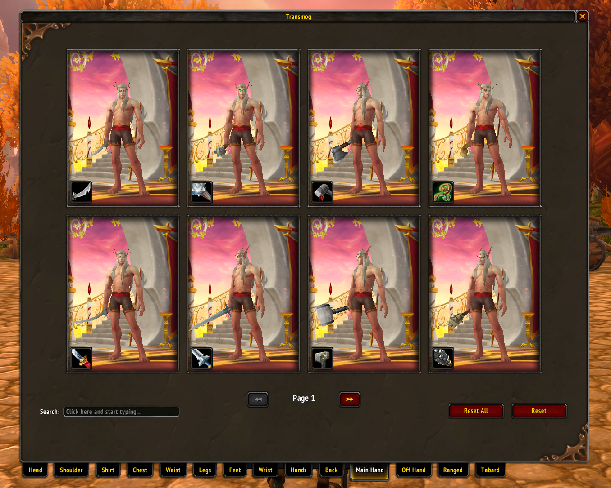

# AzerothCore Transmog System 3.3.5a

Transmog system created with AIO and Eluna for AzerothCore.

## Installation

- Make sure you have AIO and Eluna on your server/AzerothCore. For help read the mod-eluna documentation for AzerothCore [here](https://github.com/azerothcore/mod-eluna)
- Put the contents of the lua_scripts folder inside your lua scripts folder you created for Eluna/AIO
- Import the sql files inside the sql folder
- Move the patch mpq file from the patches folder to your "Drive/Game/Data" directory. If necessary rename it. Example: Patch-Z.mpq or Patch-L.mpq
- Start your server and have fun!

## WIP

- Spam prevention (click events)
- UI redesign
- Display small info text on items if you have previously obtained the transmog/display id
- Search with display id
- Weapon auras
- Spells/Character Effects